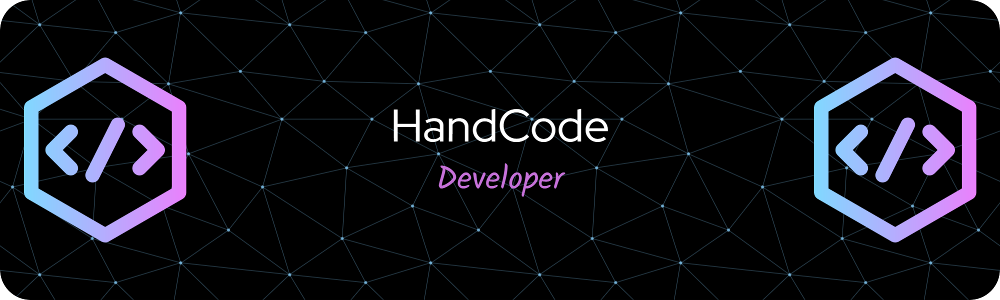

 <h1 align="center">Hi 👋, I'm Muhamad Raihan Nurhidayat</h1>
<h3 align="center">A passionate fullstack developer from Indonesia</h3>

  

# 💫 About Me:
🌱 I’m currently learning tRPC with NextJs 📫 How to reach me **raihannurhidayat19@gmail.com**

## 🌐 Socials:
    

# 💻 Tech Stack:
                                
# 📊 GitHub Stats:
 
 

